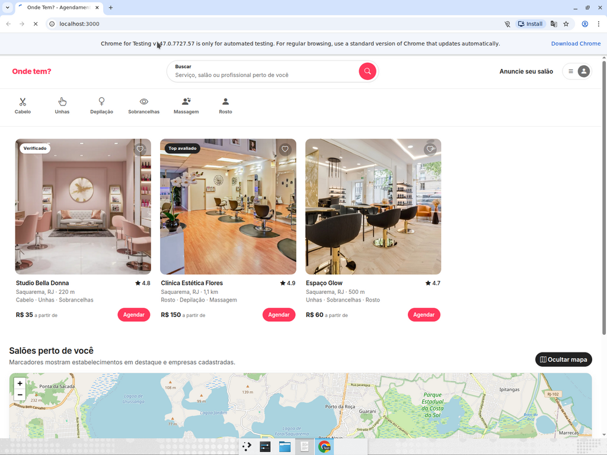
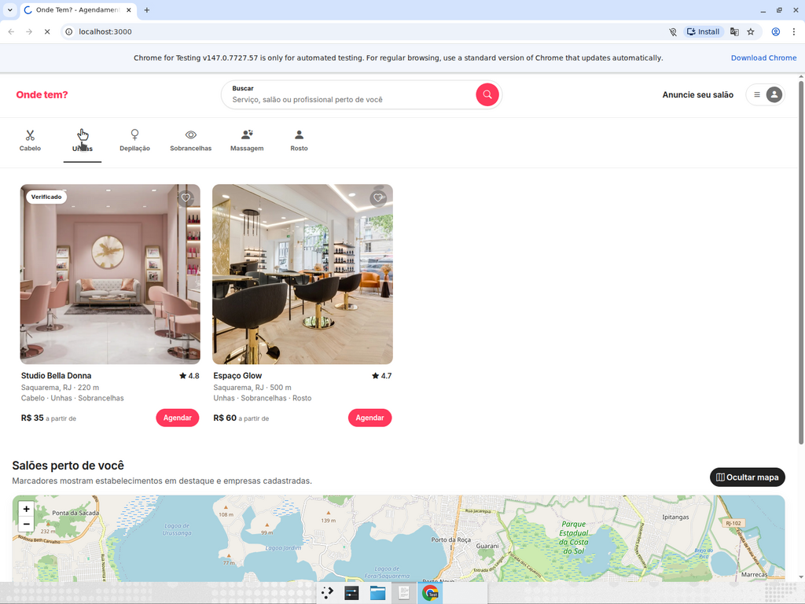
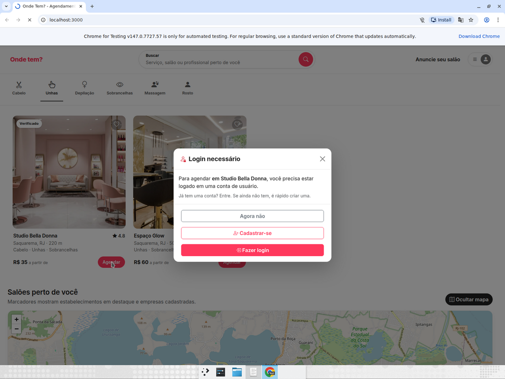
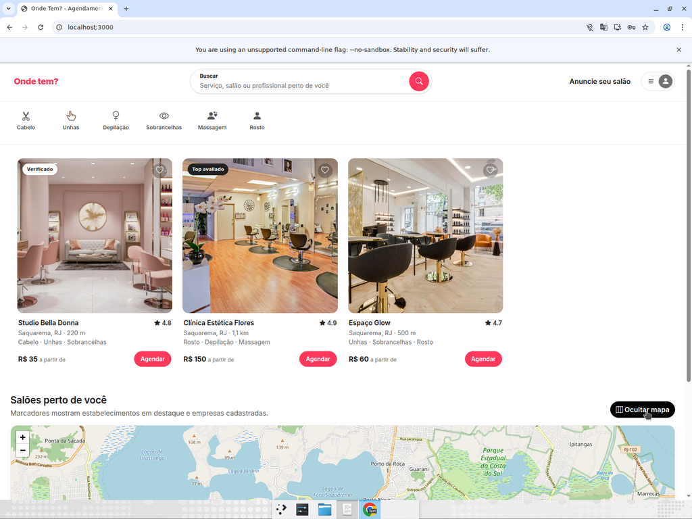
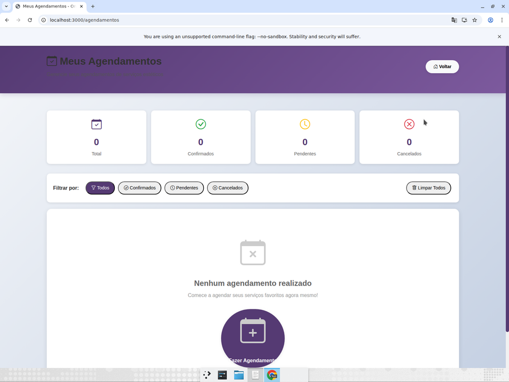
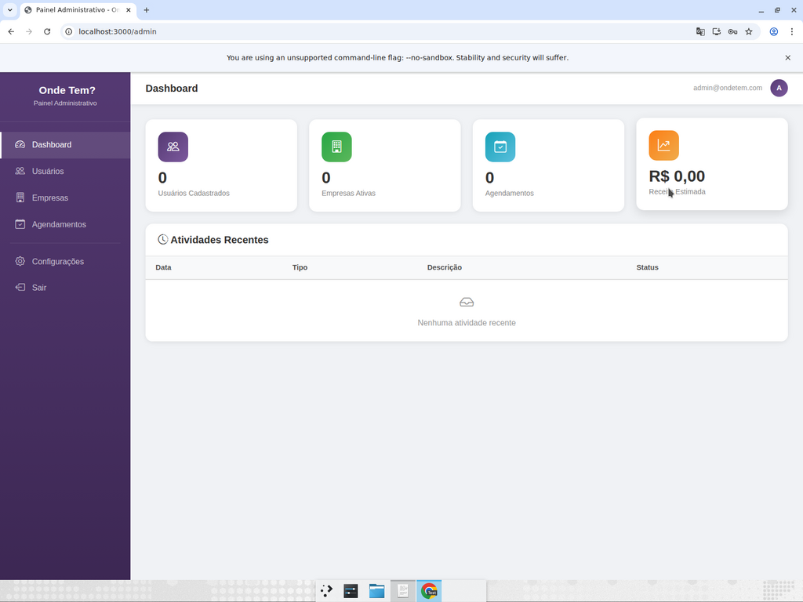

# Onde Tem? — PWA de Agendamento de Serviços Estéticos

PWA (Progressive Web App) em Node.js/Express para conectar clientes a salões, clínicas e profissionais autônomos de estética. Inclui cadastro de usuários e empresas, login por token, agendamento autenticado, painel administrativo e **mapa interativo com geolocalização**.

---

## Índice
- [Como rodar](#como-rodar)
- [Credenciais de teste](#credenciais-de-teste)
- [Páginas](#páginas)
- [Fluxograma do projeto](./docs/fluxograma.md)
- [Home redesenhada (PR #11)](#home-redesenhada-pr-11)
- [Home estilo Airbnb (PR #15 — atual)](#home-estilo-airbnb-pr-15--atual)
- [Correção do login do admin (PR #16)](#correção-do-login-do-admin-pr-16)
- [Fluxo de cadastro de empresa com localização no mapa](#fluxo-de-cadastro-de-empresa-com-localização-no-mapa)
- [Mapa de empresas próximas (para usuários)](#mapa-de-empresas-próximas-para-usuários)
- [Simulação de pagamento (cartão e Pix)](#simulação-de-pagamento-cartão-e-pix)
- [API relevante](#api-relevante)
- [Arquitetura & limitações conhecidas](#arquitetura--limitações-conhecidas)
- [Roadmap / sugestões para evolução](#roadmap--sugestões-para-evolução)
- [Resultados dos testes E2E (T1–T8)](#resultados-dos-testes-e2e-t1t8)
- [Resultados do teste E2E da home redesenhada (PR #11)](#resultados-do-teste-e2e-da-home-redesenhada-pr-11)
- [Resultados do teste E2E da home Airbnb (PR #15)](#resultados-do-teste-e2e-da-home-airbnb-pr-15)
- [Resultados do teste de login pós-PR #16](#resultados-do-teste-de-login-pós-pr-16)
- [Plano de testes](#plano-de-testes-cadastros--admin)

## Como rodar
```bash
npm install
npm start
# Servidor em http://localhost:3000

# Testes unitários/smoke (node --test nativo, sem dependências)
npm test

# Healthcheck
curl http://localhost:3000/healthz
```

### Chat IA (opcional)
O widget de chat flutuante (canto inferior direito) é proxy para o **Google Gemini** (`gemini-2.5-flash-lite`). Para ativar, defina `GEMINI_API_KEY` antes de rodar o servidor:

```bash
export GEMINI_API_KEY="sua-chave-do-google-ai-studio"
# Chave gratuita em https://aistudio.google.com/apikey
npm start
```

Sem a chave, o endpoint `POST /api/chat` responde `503` com aviso amigável e o widget mostra o erro para o usuário. A chave **nunca** é exposta ao cliente (fica só no processo do servidor). Modelo alternativo: `GEMINI_MODEL=gemini-2.5-flash npm start`.

## Credenciais de teste
| Tipo      | E-mail                 | Senha  |
|-----------|------------------------|--------|
| Admin     | `admin@ondetem.com`    | 123456 |
| Empresa   | `empresa@ondetem.com`  | 123456 |
| Usuário   | `joao@email.com`       | 123456 |

## Páginas
- **`/`** — Home com cards em destaque e **mapa interativo** mostrando a localização do usuário e das empresas cadastradas.
- **`/login`** — Login unificado (admin / empresa / usuário).
- **`/cadastro-usuario`** — Cadastro de cliente final.
- **`/cadastro-empresa`** — Cadastro de estabelecimento, **com seleção obrigatória da localização no mapa**.
- **`/agendamentos`** — Lista de agendamentos do usuário logado (exige login como `usuario`).
- **`/admin`** — Painel administrativo (exige `admin@ondetem.com`).
- **`/painel-empresa`** — Painel da empresa logada.

## Home redesenhada (PR #11)

A home (`/`) foi redesenhada com a linguagem visual de clínicas de estética premium, inspirada em [mybeleza.com.br](https://www.mybeleza.com.br/) e [onodera.com.br](https://www.onodera.com.br/). Toda a funcionalidade (filtro de categorias, agendamento, login-gate, Pix/cartão, mapa, notificações) foi preservada.

**Design system**
- Tipografia: **Playfair Display** (títulos/display) + **Inter** (UI).
- Paleta: roxo primário `#553A73`, roxo claro `#7D5AA0`, acento dourado `#C9A36B`, off-white (`#FAFAF7`, `#F5F1EC`).
- Botões com gradiente (`.btn-primary-onde`), contorno (`.btn-outline-onde`) e ghost (`.btn-ghost`); compatibilidade mantida com `.btn-danger` nas demais páginas.
- Service Worker cache bump: **v11 → v12 → v13** para invalidar CSS/JS antigos nos clientes.

**Novas seções na home**
- **Topbar** com "Encontre serviços de beleza perto de você" + atalhos para parceiro/suporte.
- **Hero** bipartido: headline em Playfair ("Seu momento de beleza, *agendado em cliques.*"), lead, CTAs, checklist e galeria com dois cards flutuantes animados ("+10.000 agendamentos" e "4.9/5 avaliação").
- **Stats bar** com 4 números de credibilidade (+500, +10k, 4.9/5, 24/7).
- **Tratamentos em alta**: 6 cards populares com preço "a partir de".
- **Como funciona**: 3 passos numerados (Descubra → Agende → Aproveite).
- **CTA empresas**: box roxo com glow dourado e CTA em branco.
- **Footer escuro**: 4 colunas (Empresa / Para você / Para seu negócio / redes sociais) + tag "Pagamento seguro • Pix e cartão".

**Cards de salão evoluídos**: badge "Verificado", rating dourado em pill, distância com ícone, preços alinhados à direita e botão "Agendar" com ícone de calendário.

## Fluxo de cadastro de empresa com localização no mapa

Ao cadastrar uma empresa em `/cadastro-empresa`, além dos dados comerciais tradicionais (CNPJ, razão social, categorias, serviços, horários, endereço), o formulário exige **marcar o ponto exato do estabelecimento no mapa**. Essa localização é persistida como `lat`/`lng` e é o que permite que clientes na home vejam a empresa no mapa e filtrem por proximidade.

A seção "Localização no Mapa" oferece três maneiras de marcar o ponto:
1. **Usar minha localização** — botão que pede permissão de geolocalização do navegador e solta o marcador na posição atual (útil para quem está cadastrando estando dentro do estabelecimento).
2. **Buscar pelo endereço preenchido** — consulta o [Nominatim (OpenStreetMap)](https://nominatim.openstreetmap.org/) com os campos de rua/número/bairro/cidade/UF/CEP que já estão no formulário e centraliza o marcador no resultado.
3. **Clicar / arrastar no mapa** — clique em qualquer ponto para mover o marcador, ou arraste o marcador já posicionado para ajuste fino.

Os campos **Latitude** e **Longitude** (somente leitura) são preenchidos automaticamente. O submit é bloqueado se o marcador não for posicionado, e o backend (`POST /api/empresas`) também valida `lat`/`lng` e retorna **400** caso venham ausentes ou fora do intervalo `[-90..90]` / `[-180..180]`.

> 💡 Quando o CEP é preenchido, o formulário já tenta geocodificar silenciosamente o endereço para sugerir um ponto inicial no mapa — o usuário só precisa ajustar se necessário.

## Mapa de empresas próximas (para usuários)

Na home (`/`), o mapa (Leaflet + OpenStreetMap) mostra três camadas:

- 🔵 **Marcador azul**: posição do usuário (pedido via `navigator.geolocation` / `L.Map.locate`).
- 🔴 **Marcadores vermelhos**: estabelecimentos "em destaque" (dados de `config.js`).
- 🟣 **Marcadores roxos**: **empresas cadastradas via `/cadastro-empresa`**, carregadas de `GET /api/empresas/publicas`.

Ao clicar em um marcador roxo, o popup mostra o nome, categorias, endereço e telefone da empresa, e — quando a geolocalização do usuário está disponível — a **distância aproximada até você** (em metros se < 1 km, senão em km), calculada com a fórmula de Haversine.

## Simulação de pagamento (cartão e Pix)

O app expõe uma **API de simulação de pagamento** para permitir testar o fluxo de agendamento de ponta a ponta sem integrar um gateway real. Todos os endpoints exigem token de login.

> ⚠️ **É uma simulação.** Nada é cobrado de verdade. Não envie dados reais de cartão. Os dados sensíveis (número completo e CVV) **nunca** são persistidos nem devolvidos pela API — apenas bandeira, 4 últimos dígitos e nome do titular.

### Regras de simulação

**Cartão de crédito (`POST /api/pagamentos/cartao`)**
- Número precisa passar no algoritmo de **Luhn**, ter entre 13 e 19 dígitos. Bandeira é detectada pelo prefixo (Visa, Mastercard, Amex, Discover, Hipercard, Elo).
- Validade em `MM/AA` ou `MM/AAAA`, precisa estar no futuro.
- CVV de 3 ou 4 dígitos.
- Números de teste:
  - ✅ Aprovado: `4111 1111 1111 1111`, `5555 5555 5555 4444`, ou qualquer outro que passe no Luhn e **não** termine em `0000`.
  - ❌ Recusado: qualquer cartão que passe no Luhn mas termine em `0000` (ex.: `4242 4242 4242 0000`) — simula "fundos insuficientes". A API responde **402 Payment Required**.

**Pix (`POST /api/pagamentos/pix` + `POST /api/pagamentos/pix/:id/confirmar`)**
- `/api/pagamentos/pix` gera uma cobrança com `status: "aguardando"`, um `txid` aleatório, um código "copia e cola" simulado e validade de 30 minutos.
- Em produção, a baixa viria por webhook do PSP. Como isso é uma simulação, expomos `POST /api/pagamentos/pix/:id/confirmar` para o próprio pagador "confirmar" o Pix — a API então passa o status para `aprovado` e devolve um `endToEndId`.
- Após a expiração (`expiraEm`), qualquer tentativa de confirmar devolve **410 Gone** com status `expirado`.

### Exemplos com `curl`

```bash
# 1) Login como usuário comum
TOKEN=$(curl -s -X POST http://localhost:3000/api/login \
  -H 'Content-Type: application/json' \
  -d '{"email":"joao@email.com","senha":"123456","tipo":"usuario"}' \
  | jq -r .token)

# 2) Pagamento com cartão — aprovado
curl -s -X POST http://localhost:3000/api/pagamentos/cartao \
  -H "Authorization: Bearer $TOKEN" -H 'Content-Type: application/json' \
  -d '{"valor":95.5,"numero":"4111 1111 1111 1111","nome":"JOAO SILVA","validade":"12/29","cvv":"123","parcelas":2}'

# 3) Pagamento com cartão — recusado (termina em 0000)
curl -s -X POST http://localhost:3000/api/pagamentos/cartao \
  -H "Authorization: Bearer $TOKEN" -H 'Content-Type: application/json' \
  -d '{"valor":50,"numero":"4242 4242 4242 0000","nome":"JOAO","validade":"12/29","cvv":"123"}'

# 4) Gerar cobrança Pix
PIX=$(curl -s -X POST http://localhost:3000/api/pagamentos/pix \
  -H "Authorization: Bearer $TOKEN" -H 'Content-Type: application/json' \
  -d '{"valor":120.75}')
echo "$PIX"

# 5) Confirmar Pix (simula baixa do PSP)
PIX_ID=$(echo "$PIX" | jq -r .dados.id)
curl -s -X POST "http://localhost:3000/api/pagamentos/pix/$PIX_ID/confirmar" \
  -H "Authorization: Bearer $TOKEN"

# 6) Listar pagamentos do usuário logado
curl -s http://localhost:3000/api/pagamentos -H "Authorization: Bearer $TOKEN"
```

### UI integrada

No modal de agendamento da home, ao escolher **Cartão de Crédito** aparece um formulário com máscaras para número, validade e CVV. Ao escolher **Pix**, ao confirmar é exibido o QR Code + "copia e cola" e um botão **"Já paguei (simular confirmação)"** que dispara `POST /api/pagamentos/pix/:id/confirmar` e, em seguida, cria o agendamento com o `pagamentoId` associado.

## API relevante

| Método | Rota                                         | Descrição                                                                 |
|-------:|----------------------------------------------|---------------------------------------------------------------------------|
| POST   | `/api/login`                                 | Autentica admin/empresa/usuário e devolve `token` + `usuario`.            |
| POST   | `/api/empresas`                              | Cadastra nova empresa. **Exige `lat`/`lng` válidos**.                      |
| GET    | `/api/empresas/publicas`                     | Lista empresas com coordenadas válidas (campos seguros).                   |
| GET    | `/api/empresas`                              | Lista completa para o painel admin (sem senha).                            |
| POST   | `/api/agendamentos`                          | Cria agendamento (exige token de `usuario`). Aceita `pagamentoId` opcional. |
| POST   | `/api/pagamentos/cartao`                     | **Simula** cobrança no cartão de crédito (Luhn, validade, CVV).           |
| POST   | `/api/pagamentos/pix`                        | **Simula** geração de cobrança Pix com QR Code.                           |
| POST   | `/api/pagamentos/pix/:id/confirmar`          | **Simula** confirmação do Pix (status `aguardando` → `aprovado`).          |
| GET    | `/api/pagamentos`                            | Lista pagamentos do usuário logado (admin vê todos).                       |
| GET    | `/api/pagamentos/:id`                        | Consulta status de um pagamento específico.                                |
| GET    | `/healthz`                                   | Healthcheck: `uptime`, `timestamp` e contadores do "banco" em memória.     |

## Arquitetura & limitações conhecidas

Projeto **acadêmico**, em Node/Express puro (sem framework web adicional, sem ORM). Intencionalmente simples para facilitar estudo, mas com vários pontos que precisariam evoluir para produção:

- **Banco de dados em memória** (`db = { usuarios, empresas, agendamentos, pagamentos, sessoes }` em `server.js`). Os dados são perdidos a cada restart. Para produção, migrar para SQLite / PostgreSQL + camada de acesso (Prisma, Knex ou `better-sqlite3`).
- **Senhas em plaintext** nas seeds e no cadastro. Para produção, salvar `bcrypt.hash(senha, 10)` e trocar o fluxo de login por comparação com `bcrypt.compare`.
- **Sessões em `Map`** com tokens hex de 24 bytes. Sem expiração nem rotação. Alternativas: JWT assinado + refresh token, ou `express-session` com store persistente.
- **Sem rate-limit / helmet / CORS restrito**. Em produção: `helmet()`, `express-rate-limit` nas rotas de login/cadastro, CORS com allowlist.
- **Simulação de pagamento**: `/api/pagamentos/cartao` e `/api/pagamentos/pix` **não integram** gateway real — seguem regras determinísticas (Luhn + sufixo `0000` recusa) para permitir testes E2E. Nunca envie dados reais de cartão.
- **Chave VAPID de exemplo** em `app.js`. Para enviar push push real do servidor, gerar um par com `web-push generate-vapid-keys` e guardar a privada como variável de ambiente.
- **PWA**: `manifest.json` usa `img/Logo-png 5.svg` como ícone (192/512/any/maskable). Para uma instalação mais bonita, gerar PNGs dedicados em 192×192, 512×512 e ícone maskable com padding de 10% nas bordas.

## Roadmap / sugestões para evolução

Boas próximas evoluções, em ordem de impacto × esforço:

1. **Persistência real** — swap do `db` em memória por SQLite (`better-sqlite3`) com migrations simples. Zero dependências pesadas e resolve o maior limite atual.
2. **Senhas com `bcrypt`** + **JWT** (ou `express-session`). Fecha o principal buraco de segurança do backend.
3. **`helmet` + `express-rate-limit`** em `/api/login`, `/api/usuarios` e `/api/empresas` para mitigar brute-force e headers faltando.
4. **Filtro por categoria no mapa** (hoje o filtro de categoria só esconde cards; poderia também esconder marcadores roxos correspondentes).
5. **Busca por distância** — ordenar cards na home pela distância Haversine até a geolocalização do usuário e mostrar "X km" em cada card, não só no popup.
6. **Avaliações reais** — hoje rating é seed. Permitir que usuário dê nota/comentário após `status === 'concluido'`.
7. **Deploy** — como a app é stateful (DB em memória), o passo 1 (SQLite) é pré-requisito. Depois, um `Dockerfile` + Fly.io / Render resolve.
8. **Mode escuro** — tokens CSS já estão isolados em `:root`; basta um `@media (prefers-color-scheme: dark)` espelhando os tokens.
9. **Testes automatizados de API** — hoje existe um smoke de `/healthz` com `node --test`; expandir para cobrir `/api/login`, `/api/pagamentos/cartao` aprovado/recusado e `/api/empresas` bloqueando sem `lat/lng`.

---

## Resultados dos testes E2E (T1–T8)

Última execução: **20/04/2026**, em `http://localhost:3000` (servidor Express local), Chrome maximizado, gravação única com anotações por teste. O plano completo está em [`test-plan.md`](./test-plan.md) e o relatório detalhado em [`test-report.md`](./test-report.md).

🎥 **Vídeo da execução completa:** (./docs/video/completo.mp4)

| # | Teste | Fix/feature | Resultado |
|---|-------|-------------|-----------|
| T1 | Prompt nativo de notificação aparece sozinho ao abrir `/` (sem botão 🔔 no header) | PR #8 / #9 | ✅ passed |
| T2 | Agendar sem login abre modal "Login necessário" (`href=login.html?redirect=%2F`) | PR #3 | ✅ passed |
| T3 | Login válido `joao@email.com` volta para home sem "Erro de conexão" | PR #3 | ✅ passed |
| T4 | Pix: QR + "copia e cola" + "Já paguei" → notificação "Agendamento Confirmado!" | PR #6 / #9 | ✅ passed |
| T5 | Reabrir modal após Pix: `#pixCobranca` resetado, sem QR antigo | PR #7 | ✅ passed |
| T6 | Cartão `4111 1111 1111 1111` aprovado + notificação | PR #6 / #9 | ✅ passed |
| T7 | Cadastro de empresa bloqueado sem mapa; lat/lng com 6 decimais após clique; cadastro OK | PR #5 | ✅ passed |
| T8 | Marcador roxo da empresa recém-criada na home (popup com nome, endereço, telefone e "de você") | PR #5 | ✅ passed |

> **Observação (não é bug):** o Chrome da VM de teste retorna uma geolocalização mock nos EUA, então a distância exibida no popup do marcador roxo aparece grande (~4656 km). Para um usuário real em Saquarema o cálculo Haversine produz metros/poucos km — o formato (`N m` / `N.N km` + " de você") e os dígitos estão corretos.

---

## Home estilo Airbnb (PR #15 — atual)

A home atual em `main` segue o padrão visual do [airbnb.com.br](https://www.airbnb.com.br/): produto na frente, mapa acessível via toggle. Toda a lógica (`script.js`, `server.js`, `auth-guard.js`) foi preservada.

**Novo visual**
- Topbar desktop com logo, pill de busca com label flutuante e botão circular coral, link "Anuncie seu salão" e menu de usuário à direita.
- Header mobile compacto com pill de busca inline.
- Barra de categorias horizontal scrollável estilo Airbnb (ícone + label + underline no ativo).
- **Grid produto-first** logo abaixo das categorias: cards com imagem em aspect-ratio, coração de favoritar, badge "Verificado" / "Top avaliado", rating, localização + distância, preço "a partir de" e botão Agendar.
- Seção própria para o mapa com botão **Ocultar mapa** / **Mostrar mapa** (`leafletMap.invalidateSize()` ao reexibir).
- Tipografia Inter + paleta coral `#FF385C` sobre `#222`.
- Service Worker cache bump para **v23** na mesclagem com `main`.

**Hooks preservados** (mesmo IDs/classes que o `script.js` espera): `.card-salao[data-index]`, `.card-salao .card-body .btn`, `.category-item > p`, `.search-bar input`, `#modalLoginNecessario`, `#modalAgendamento`, `#blocoCartao`, `#blocoPix`, `#pixCobranca`, `#map`, bottom-nav mobile.

## Correção do login do admin (PR #16)

Antes: tentar logar no painel interno de `/admin` com `admin@ondetem.com` / `123456` retornava **"E-mail ou senha incorretos."**. O form enviava `{ email, senha }`, mas `POST /api/login` exige `{ email, senha, tipo: 'admin' }`. Além disso, logar pelo `/login` (aba Admin) redirecionava para `/admin` mas o painel continuava pedindo login de novo, porque `admin.html` não carregava `auth-guard.js` e não conhecia a sessão do `OndeTemAuth`.

Depois (PR #16 merged):
- `admin.html` passou a incluir `<script src="auth-guard.js"></script>`.
- Nova função `verificarLoginAdmin()` faz **SSO**: se já existe `OndeTemAuth.obterUsuario()` com `tipo === 'admin'`, pula o form e abre o painel direto.
- O form interno continua disponível como fallback, agora enviando `tipo: 'admin'` e persistindo `token + usuario` via `OndeTemAuth.salvarSessao()`, o que permite o logout invalidar a sessão server-side via `POST /api/logout`.
- Logout distingue os dois caminhos: se houver sessão SSO de admin, chama `OndeTemAuth.logout()` (que também redireciona para `/login`); caso contrário faz apenas o cleanup do `sessionStorage` + troca a UI para o form.

---

## Resultados do teste E2E da home redesenhada (PR #11)

Execução em `http://localhost:3000`, branch `devin/1776719299-home-redesign`, Chrome maximizado, gravação única com anotações. Plano em [`test-plan-redesign.md`](./test-plan-redesign.md) e relatório em [`test-report.md`](./test-report.md).

**Regressão crítica coberta:** a redesign trocou `btn-danger` → `btn-primary-onde` e adicionou um `<i class="bi bi-calendar2-heart">` dentro do botão Agendar. O handler antigo em `script.js` fazia `e.target.classList.contains('btn-danger')`, que falhava tanto pela classe nova quanto por cliques caindo no `<i>` filho. O fix (commit `ef0f30a`) usa `e.target.closest('.card-salao .card-body .btn')`, resiliente a classes e children.

| # | Asserção | Resultado |
|---|----------|-----------|
| A1 | Hero em Playfair com "agendado em cliques." + 2 cards flutuantes (+10.000, 4.9/5) | ✅ passed |
| A2 | 4 `.stat` na stats bar | ✅ passed |
| A3 | 6 `.treatment-card` em "Tratamentos em alta" | ✅ passed |
| A4 | Footer com 3 `h6` (Empresa / Para você / Para seu negócio) | ✅ passed |
| B1 | Filtro "Cabelo" esconde Clínica Flores e Espaço Glow | ✅ passed |
| C1 | Clique em **Agendar** abre `#modalAgendamento` (valida fix do `btn-primary-onde`) | ✅ passed |
| C2 | Pix gera `#pixCobranca` com QR + copia-e-cola + botão "Já paguei" | ✅ passed |
| C3 | "Já paguei" confirma e exibe toast + notificação desktop | ✅ passed |
| D1 | Mapa Leaflet carrega tiles OSM + marcador azul do usuário + marcador roxo da empresa | ✅ passed |

---

## Resultados do teste E2E da home Airbnb (PR #15)

Execução em `http://localhost:3000`, branch `devin/1776731157-airbnb-home`, Chrome maximizado, gravação única. Plano em [`test-plan-airbnb.md`](./test-plan-airbnb.md) e relatório em [`test-report-airbnb.md`](./test-report-airbnb.md).

| # | Asserção | Resultado |
|---|----------|-----------|
| T1 | Home renderiza pill de busca + categorias + grid de cards **acima** do mapa | ✅ passed |
| T2 | Filtro "Unhas" mantém só Estúdio Amora, esconde Barbearia e Clínica Estética | ✅ passed |
| T3 | Clique em **Agendar** deslogado abre `#modalLoginNecessario` (não abre modal de agendamento) | ✅ passed |
| T4 | Após login (`joao@email.com`), **Agendar** abre `#modalAgendamento` com Pix default | ✅ passed |
| T5 | Toggle **Ocultar mapa** / **Mostrar mapa** funciona e tiles voltam a carregar sem faixas cinzas | ✅ passed |

### Evidências (prints)

**T1 — Novo layout com grid produto-first**



**T2 — Filtro de categoria "Unhas" ativo**



**T3 — Modal "Login necessário" ao tentar agendar deslogado**



**T5 — Mapa reexibido após toggle com tiles completos**



---

## Resultados do teste de login pós-PR #16

Execução em `http://localhost:3000` após o merge do PR #16 em `main`. Plano em [`test-plan-logins.md`](./test-plan-logins.md) e relatório em [`test-report-logins.md`](./test-report-logins.md).

| # | Asserção | Resultado |
|---|----------|-----------|
| T1 | `joao@email.com` loga em `/login` → home → `/agendamentos` renderiza "Meus Agendamentos" sem redirect | ✅ passed |
| T2 | `admin@ondetem.com` na aba Admin de `/login` → `/admin` abre painel via SSO sem pedir login de novo | ✅ passed |

### Evidências (prints)

**T1 — Painel do usuário em `/agendamentos`**



**T2 — Painel administrativo aberto via SSO**



Sidebar "Onde Tem? Painel Administrativo", topbar com `admin@ondetem.com` e os 4 cards do dashboard (Usuários Cadastrados / Empresas Ativas / Agendamentos / Receita Estimada).

---

# Plano de Testes: Cadastros + Admin

## O Que Mudou
Três novas páginas adicionadas ao PWA "Onde Tem?":
1. **Cadastro de usuário** (`/cadastro-usuario`) — formulário completo com dados pessoais, contato, endereço e senha
2. **Cadastro de empresa** (`/cadastro-empresa`) — formulário comercial com CNPJ, categorias, serviços, horários **e seleção obrigatória de localização no mapa**
3. **Dashboard Admin** (`/admin`) — login + painel de gerenciamento com estatísticas e tabelas de usuários/empresas/agendamentos

Navegação atualizada: `login.html` agora possui os botões "Cadastrar como Usuário" e "Cadastrar como Empresa". `index.html` possui um link "Admin" no cabeçalho.

## Fluxo Principal: Cadastro de Ponta a Ponta + Verificação do Admin

### Teste 1: Navegação do Login para as Páginas de Cadastro
**Passos:**
1. Navegue para `http://localhost:3000/login`
2. Verifique se a página exibe dois novos botões: "Cadastrar como Usuário" e "Cadastrar como Empresa"
3. Clique em "Cadastrar como Usuário"

**Critérios de aprovação:** O navegador redireciona para `/cadastro-usuario.html` e exibe o formulário com o título "Cadastro de Usuário"

### Teste 2: Formulário de Cadastro de Usuário — Envio com Dados Válidos
**Passos:**
1. Em `/cadastro-usuario`, preencha:
   - Nome Completo: "Maria Silva"
   - CPF: "123.456.789-00"
   - Data de Nascimento: "1990-05-15"
   - E-mail: "maria@teste.com"
   - Telefone: "(21) 99999-1234"
   - Senha: "Teste@123"
   - Confirmar Senha: "Teste@123"
   - Marque o checkbox "termos de uso"
2. Clique no botão "Criar Minha Conta"

**Critérios de aprovação:**
- Um banner de alerta verde aparece no topo com um texto contendo "Cadastro realizado com sucesso!"
- O botão exibe temporariamente um *spinner* com o texto "Cadastrando..." durante o envio
- Após cerca de 2 segundos, a página redireciona para `login.html`

### Teste 3: Formulário de Cadastro de Usuário — Indicador de Força da Senha
**Passos:**
1. Em `/cadastro-usuario`, digite "abc" no campo Senha
2. Observe o indicador de força da senha
3. Em seguida, digite "Abc123!@" no campo Senha
4. Observe o indicador de força da senha novamente

**Critérios de aprovação:**
- "abc" → a barra de força exibe o estado "fraca" com a cor vermelha/laranja
- "Abc123!@" → a barra de força exibe o estado "forte" com a cor verde, e o texto de dica diz "Senha forte!"

### Teste 4: Página de Cadastro de Empresa Carrega com Todas as Seções
**Passos:**
1. Navegue para `http://localhost:3000/cadastro-empresa`
2. Role a página pelo formulário

**Critérios de aprovação:** A página exibe todas as seções:
- Seção "Dados da Empresa" com os campos `nomeEmpresa`, `cnpj`, `razaoSocial`, `nomeFantasia` e `descricaoEmpresa`
- Seção "Categorias de Serviços" com 6 checkboxes (Cabelo, Unhas, Depilação, Sobrancelhas, Massagem, Rosto)
- Seção "Serviços Oferecidos" com o botão "Adicionar Serviço"
- Seção "Contato" com os campos `email`, `telefone`, `whatsapp` e `instagram`
- Seção "Endereço do Estabelecimento" com o campo `CEP`
- Seção **"Localização no Mapa *"** com o mapa Leaflet, botões "Usar minha localização" e "Buscar pelo endereço preenchido", e os campos somente-leitura Latitude e Longitude
- Seção "Horário de Funcionamento" com os checkboxes de dias e campos de horário
- Seção "Senha de Acesso" com os campos `nomeResponsavel`, `senha` e `confirmarSenha`
- O botão de envio "Cadastrar Empresa" está visível

### Teste 4a: Cadastro de Empresa — Localização no Mapa é Obrigatória
**Passos:**
1. Em `/cadastro-empresa`, preencha todos os campos textuais obrigatórios (Dados, Categorias, Contato, Endereço, Horários, Senha) mas **não** interaja com o mapa
2. Clique em "Cadastrar Empresa"

**Critérios de aprovação:**
- O formulário **não** é enviado
- A seção "Localização no Mapa" entra em foco (scroll) e exibe o status vermelho "Marque a localização da empresa no mapa antes de cadastrar."
- O campo Latitude aparece em estado inválido (borda vermelha)

### Teste 4b: Cadastro de Empresa — Marcar via Clique no Mapa
**Passos:**
1. Em `/cadastro-empresa`, clique em qualquer ponto dentro do mapa da seção "Localização no Mapa"
2. Observe os campos Latitude e Longitude

**Critérios de aprovação:**
- Um marcador aparece exatamente no ponto clicado
- Os campos Latitude e Longitude são preenchidos automaticamente com 6 casas decimais
- O status abaixo do mapa fica verde: "Localização marcada: -22.xxxxxx, -42.xxxxxx"
- Arrastar o marcador atualiza os campos Latitude/Longitude em tempo real

### Teste 4c: Cadastro de Empresa — Buscar pelo Endereço
**Passos:**
1. Em `/cadastro-empresa`, preencha o CEP (ex.: `28990-000` para Saquarema)
2. Aguarde o autocompletar pelo ViaCEP preencher rua/bairro/cidade/UF
3. Clique em "Buscar pelo endereço preenchido"

**Critérios de aprovação:**
- O mapa centraliza na região geocodificada e solta um marcador
- Latitude/Longitude são preenchidos
- Status verde "Localização marcada: …" aparece

### Teste 4d: Cadastro Completo Aparece no Mapa da Home
**Passos:**
1. Em `/cadastro-empresa`, cadastre uma empresa válida (com todos os campos e localização no mapa)
2. Após o redirecionamento para `/login`, abra `/` em outra aba
3. Aguarde o mapa carregar

**Critérios de aprovação:**
- Um marcador **roxo** aparece na posição cadastrada
- Ao clicar no marcador, o popup mostra nome, categorias, endereço e (se a geolocalização estiver concedida) a distância aproximada até o usuário

### Teste 5: Login de Admin — Credenciais Corretas
**Passos:**
1. Navegue para `http://localhost:3000/admin`
2. Verifique se o formulário de login está visível com o título "Painel Admin"
3. Insira o email: "admin@ondetem.com"
4. Insira a senha: "123456"
5. Clique no botão "Entrar"

**Critérios de aprovação:**
- O formulário de login desaparece
- O painel do dashboard admin aparece com uma barra lateral mostrando: Dashboard, Usuários, Empresas, Agendamentos, Configurações
- O Dashboard exibe 4 cards de estatísticas: "Usuários Cadastrados", "Empresas Ativas", "Agendamentos" e "Receita Estimada"
- A barra superior exibe o título "Dashboard" e o e-mail "admin@ondetem.com"

### Teste 6: Login de Admin — Credenciais Incorretas
**Passos:**
1. Navegue para `http://localhost:3000/admin` (página recarregada/nova)
2. Insira o email: "wrong@email.com"
3. Insira a senha: "wrongpass"
4. Clique em "Entrar"

**Critérios de aprovação:**
- O formulário de login permanece visível (sem troca de painel)
- Um texto de erro em vermelho aparece dizendo "E-mail ou senha incorretos."

### Teste 7: Painel Admin — Navegação da Barra Lateral
**Passos:**
1. Após o login bem-sucedido no admin, clique em "Usuários" na barra lateral
2. Em seguida, clique em "Empresas" na barra lateral
3. Depois, clique em "Configurações" na barra lateral

**Critérios de aprovação:**
- Clicar em "Usuários" → o título da barra superior muda para "Usuários" e exibe a tabela de usuários com "Nenhum usuário cadastrado"
- Clicar em "Empresas" → o título da barra superior muda para "Empresas" e exibe a tabela de empresas com "Nenhuma empresa cadastrada"
- Clicar em "Configurações" → o título da barra superior muda para "Configurações", exibe o campo de nome da plataforma com o valor "Onde Tem?" e o e-mail de suporte "suporte@ondetem.com"

### Teste 8: Página Inicial (Index) — Link do Admin no Cabeçalho
**Passos:**
1. Navegue para `http://localhost:3000/`
2. Verifique o cabeçalho em busca de um botão/link para "Admin"

**Critérios de aprovação:** O cabeçalho exibe um link/botão "Admin" que aponta para `admin.html`

## Evidências de Código
- `server.js` linhas 35-45: Novas rotas para `/cadastro-usuario`, `/cadastro-empresa`, `/admin`
- `server.js` linhas 101-130: Endpoints da API para `POST /api/usuarios` e `POST /api/empresas`
- `server.js` linhas 52-63: `POST /api/login` com credenciais de admin fixadas no código (*hardcoded*)
- `login.html` linhas 38-41: Novos botões de cadastro
- `index.html` linha 33: Link do Admin no cabeçalho
- `cadastro-usuario.html` linhas 606-677: Manipulador de envio (*submit handler*) do formulário
- `cadastro-empresa.html` linhas 724-832: Manipulador de envio do formulário
- `admin.html` linhas 770-810: Manipulador de login do admin
- `admin.html` linhas 836-873: Manipulador de navegação da barra lateral
