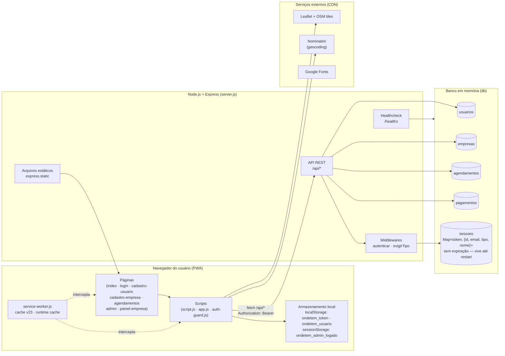
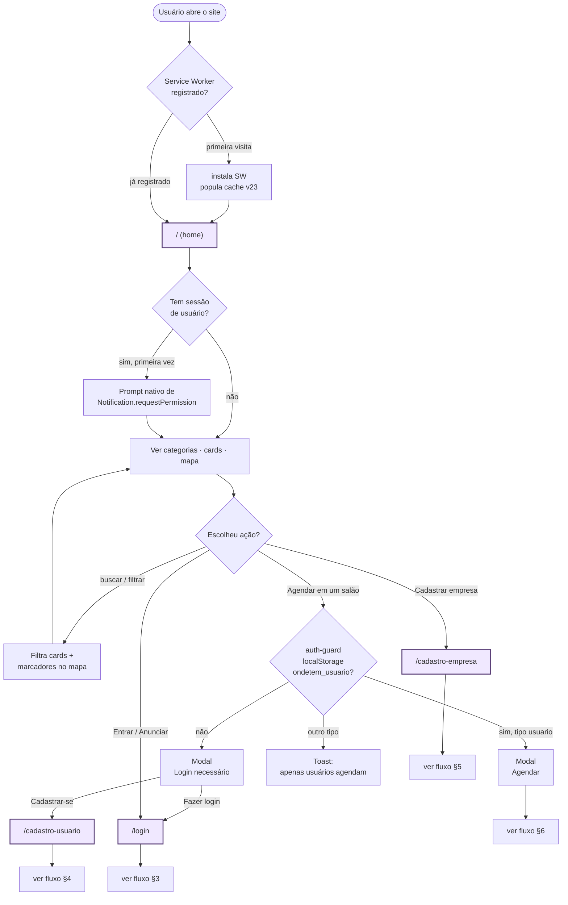
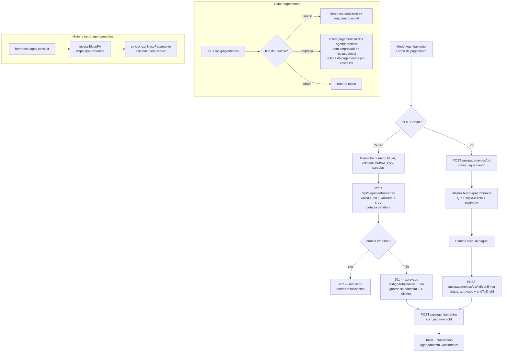
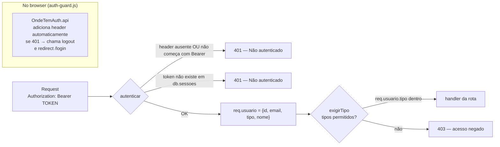
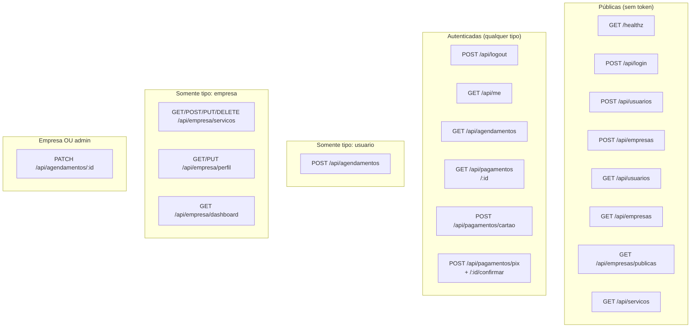
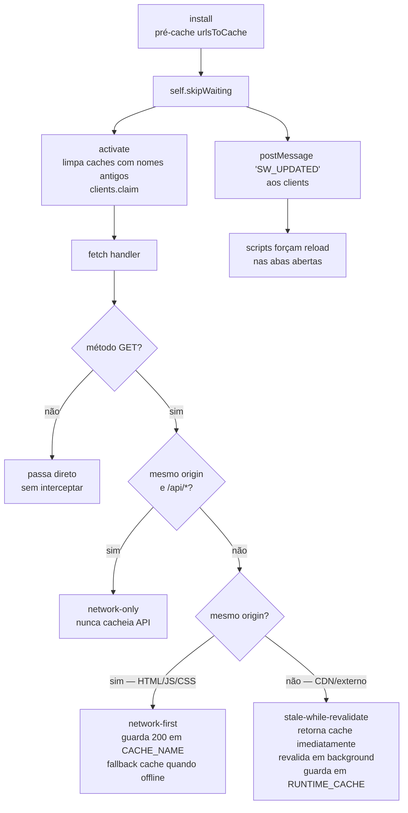
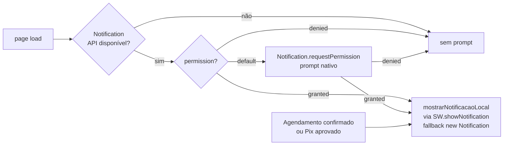

# Fluxograma do projeto "Onde Tem?"

Documento completo dos fluxos do PWA: arquitetura, autenticação, jornadas de cada tipo de usuário (visitante, cliente, empresa, admin), pagamento, Service Worker e endpoints REST.

Todos os diagramas usam [Mermaid](https://mermaid.js.org/), renderizado automaticamente pelo GitHub.

---

## 1. Arquitetura em camadas



---

## 2. Jornada geral (decisão por tipo de usuário)



---

## 3. Autenticação — login de usuário / empresa / admin (SSO)

```mermaid
flowchart TD
    A(["/login"]) --> B[Selecionar aba:<br/>Usuário · Empresa · Admin]
    B --> C[Preencher email + senha]
    C --> D[POST /api/login<br/>body: {email, senha, tipo}]
    D --> E{servidor<br/>valida em db}
    E -->|não encontra| Erro[401 — credenciais inválidas]
    Erro --> A
    E -->|match| F[cria token em db.sessoes<br/>armazena {id, email, tipo, nome}<br/>sem expiração]
    F --> G[200 OK<br/>retorna {token, usuario}]
    G --> H["OndeTemAuth.salvarSessao<br/>localStorage: ondetem_token + ondetem_usuario"]
    H --> I{destinoPorTipo}
    I -->|tipo: usuario| Home["/"]
    I -->|tipo: empresa| PE["/painel-empresa"]
    I -->|tipo: admin| Adm["/admin"]

    Adm --> Guard{verificarLoginAdmin<br/>OndeTemAuth.obterUsuario<br/>tipo === admin?}
    Guard -->|sim — SSO| Panel[mostrarPainel]
    Guard -->|não| Form[form interno de /admin<br/>POST /api/login com tipo:admin]
    Form -->|OK| SaveDup["OndeTemAuth.salvarSessao<br/>+ sessionStorage.ondetem_admin_logado"]
    SaveDup --> Panel

    Panel --> Dash[Dashboard<br/>Usuários · Empresas · Agendamentos · Receita]

    subgraph Logout["Logout"]
        L1[clique em Sair] --> L2{OndeTemAuth<br/>tem admin SSO?}
        L2 -->|sim| L3[OndeTemAuth.logout<br/>→ POST /api/logout<br/>→ limpa localStorage<br/>→ redirect /login]
        L2 -->|não| L4[limpa sessionStorage<br/>esconde painel<br/>mostra form interno]
    end
```

---

## 4. Cadastro + uso do cliente (tipo `usuario`)

```mermaid
flowchart TD
    A(["/cadastro-usuario"]) --> B[Preencher: nome, email,<br/>telefone, CPF, endereço,<br/>data nasc., gênero, senha]
    B --> C[POST /api/usuarios]
    C --> D{validação}
    D -->|email duplicado| DE[409 — E-mail já cadastrado]
    D -->|OK| E[db.usuarios.push<br/>retorna 201]
    E --> F[redirect /login]

    F --> G[Login §3] --> Home["/"]

    Home --> Pick[Escolhe salão<br/>+ clica Agendar]
    Pick --> Modal[#modalAgendamento<br/>serviço · data · hora · obs · valor + forma pagamento]
    Modal --> Submit[submit]
    Submit --> PayFlow[§6 — Pagamento]
    PayFlow --> AgendReq[POST /api/agendamentos<br/>Authorization: Bearer token<br/>inclui pagamentoId]
    AgendReq --> Mid{middleware<br/>exigirTipo usuario}
    Mid -->|tipo != usuario| Neg[403]
    Mid -->|OK| AgendDB[db.agendamentos.push<br/>status: pendente]
    AgendDB --> Toast[toast + notificação local<br/>via SW.showNotification]
    Toast --> MeusAg[/agendamentos<br/>lista os agendamentos<br/>do usuario]
```

---

## 5. Cadastro + uso da empresa (tipo `empresa`)

```mermaid
flowchart TD
    A(["/cadastro-empresa"]) --> B[Dados comerciais<br/>CNPJ · razão social · categorias · serviços · horários]
    B --> C[Endereço estruturado<br/>rua · número · bairro · cidade · UF · CEP]
    C --> D[Localização no Mapa *<br/>- Usar minha localização<br/>- Buscar pelo endereço Nominatim<br/>- clicar / arrastar marcador]
    D --> E{lat/lng<br/>preenchidos?}
    E -->|não| E0[bloqueia submit<br/>Marque a localização da empresa]
    E0 --> D
    E -->|sim| F[POST /api/empresas<br/>payload completo + lat/lng]
    F --> G{validação server}
    G -->|lat/lng inválido| GErr400[400 — localização inválida]
    G -->|email duplicado| GErr409[409 — E-mail já cadastrado]
    G -->|OK| H[db.empresas.push<br/>{ativa: true}<br/>retorna 201]
    H --> I[redirect /login]

    I --> Login[Login tipo empresa §3] --> Painel["/painel-empresa"]

    Painel --> Tabs{O que quer?}
    Tabs -->|Perfil| P1[GET/PUT /api/empresa/perfil]
    Tabs -->|Serviços| P2[CRUD /api/empresa/servicos]
    Tabs -->|Agendamentos| P3[GET /api/agendamentos<br/>filtrado por empresa]
    P3 --> Aceitar[PATCH /api/agendamentos/:id<br/>status: pendente · confirmado · recusado · concluido]
    Tabs -->|Dashboard| P4[GET /api/empresa/dashboard<br/>totais + receita]

    subgraph Public["Home do cliente final"]
        PubGet[GET /api/empresas/publicas<br/>só campos públicos + lat/lng]
        PubGet --> PubMap[marcadores roxos no mapa<br/>popup com distância Haversine]
    end
    H -.visível em.-> PubGet
```

---

## 6. Fluxo de pagamento (simulação — PR #6/7)



---

## 7. Middleware de autenticação e autorização



---

## 8. Mapa de rotas REST (server.js)



---

## 9. Service Worker — ciclo de vida e estratégias de cache



---

## 10. Notificações (PR #8/9)



---

## 11. Matriz de permissões

| Rota / tela | Visitante | Usuário | Empresa | Admin |
|---|---|---|---|---|
| `/` (home, ver cards/mapa) | ✅ | ✅ | ✅ | ✅ |
| Agendar em um salão | ❌ (modal login) | ✅ | ❌ | ❌ |
| `/agendamentos` | ❌ | ✅ próprios | ❌ | ❌ |
| `/painel-empresa` | ❌ | ❌ | ✅ | ❌ |
| `/admin` | ❌ | ❌ | ❌ | ✅ (SSO) |
| `POST /api/empresa/*` | ❌ | ❌ | ✅ | ❌ |
| `PATCH /api/agendamentos/:id` | ❌ | ❌ | ✅ | ✅ |
| `GET /api/pagamentos` | ❌ | ✅ filtrados | ✅ filtrados | ✅ todos |
| `GET /api/empresas/publicas` | ✅ | ✅ | ✅ | ✅ |

---

## 12. Legenda

- **PWA**: Progressive Web App servido por `express.static` + Service Worker.
- **Token**: UUID gerado no `POST /api/login`, guardado em `db.sessoes` (`Map<token, usuario>`) **sem expiração** — a sessão persiste enquanto o servidor estiver rodando. Reiniciar o servidor invalida todos os tokens (consequência do `db` em memória).
- **OndeTemAuth**: IIFE em `auth-guard.js` que encapsula `salvarSessao / obterUsuario / exigirLogin / api / logout` usando `localStorage`.
- **SSO admin**: o painel `/admin` aceita sessão do `OndeTemAuth` vinda do login em `/login` (aba Admin) sem pedir login novamente.
- **db**: objeto em memória — não persiste após reinício do servidor (limitação conhecida, ver README).
